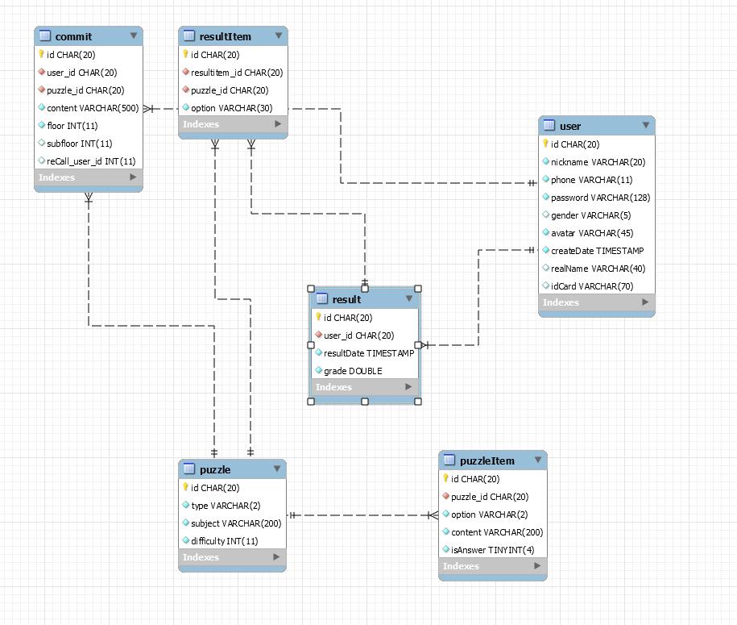

# Computer Science Base Puzzle Web

> Solutions to Basic Questions in Computer Science.

## Development Environment

* Maven 3.6.0
* Java 1.8.0_221

## Current Progress

### Pre-development Progress

* Build Tool Class

  * Build Data Access Object auto build tool 🕚
  * Build service auto build tool 🕙
  * Build automatic injection tool 🕣
  * Build inversion of control Tool 🕣
  * Build Anti-theft Chain Tool ✅
  * Build Heartbeat Tool ✅
  * Build encryption Tool ✅
    * AES ✅
    * RSA ✅
    * SHA ✅
    * MD5 ✅
  * Build token Tool ✅
  * Build Mail Tool ✅
  * Build Nanoflake builder ✅
  * Build Charset transfer Tool ✅
  * Build Verify Code builder ✅
  * Build JSON builder ✅
  * Short Message Verification Module  ✅
  
  

### Document Progress

* '需求分析' file build
* '概要设计' file build
* '详细设计' file build
* '编码' file build
* '测试' file build
* '验收' file build

### Post-development Progress

* AB Test
  * Service Test
    * Max QPS: ?
    * Average CPU use: ?
    * Average Memory use: ?
  * Link Test
    * Max QPS: ?
    * Average CPU use: ?
    * Average Memory use: ?

## Modular Progress

* LOGIN
* REGISTER ✅

## Database Structure

> temporary database structure